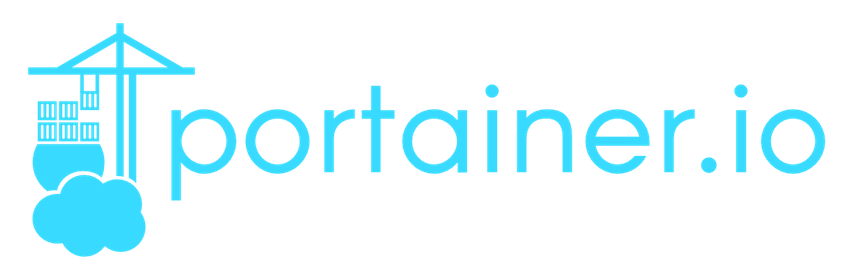
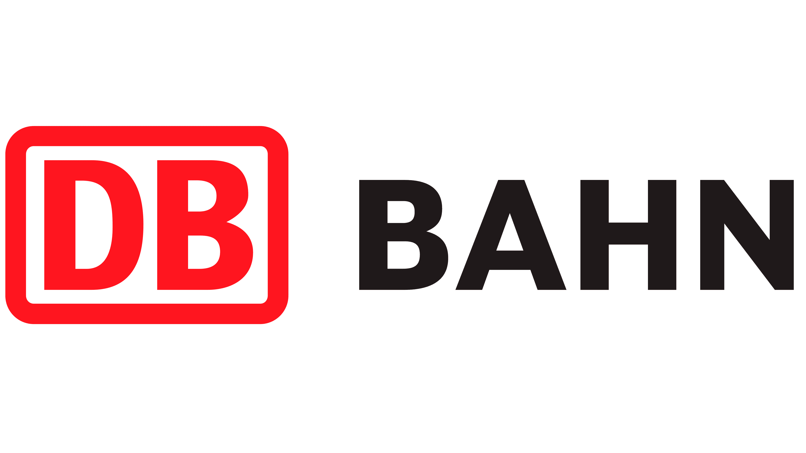

  
    

  <h1>🗿heyFordy's 
      Home Assistant🏡
          <b>Addon</b> Repository</h1>

  

      <h2 style="color: orange; border-bottom: 0; display: inline-block; direction: ltr;">
      <i><u>⭐️ View Available Add-ons</u></i>
      </h2>

  
  | Logo | Add-on |
  |:----:|:---|
  |  | [**Portainer**](./portainer) |
  |  | [**🗿 » AppDaemon [Mod]**](./appdaemon) |
  |  | [**🔊 • Shairport-Sync [AirPlay]**](./airplay_web) |
  |  | [**BetterBahn**](./betterbahn) |
  |  | [**MC Bedrock Server**](./mcbedrock) |
  |  | [**MCXboxBroadcast**](./mcxboxbroadcast) |
  |  | [**OG HomeKit**](./og-homekit) |
  |  | [**OG Pi-hole DNS-Server**](./og-pi-hole) |

> [!CAUTION]
> Everything is **work in progress**! Most stuff won't work or runs **unstable**!

## Installation (Easy)

## Installation (Manual)
» Add this Repository to Home Assistant:
   - Settings > Add-Ons > Add-On Store
   -  _(top right corner)_ > Repositories > Enter URL: `https://ha-addons.heyfordy.dev`
   - **+ Add**

---

> [!NOTE]
> Refresh the Add-On Store Page after adding the repo to avoid caching issues

# License

[MIT](LICENSE)